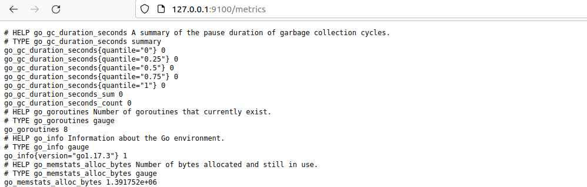

# devops-netology_3.4
1. 
- unit файл:  
[Unit]  
Description=Node Exporter Service  
After=network.target  

    [Service]  
EnvironmentFile=-/opt/node/node_exporter  
ExecStart=/usr/local/bin/node_exporter $options  
ExecReload=/bin/kill -HUP $MAINPID  
Restart=on-failure  

    [Install]  
WantedBy=multi-user.target  

- Добавление опций: ExecStart=/opt/my_service $MY_OPTIONS через внешний файл: EnvironmentFile=-/opt/node/node_exporter  

- автозапуск: systemctl enable node_exporter  
- автоматический запуск после перезагрузки:  
node_exporter.service - Node Exporter Service  
     Loaded: loaded (/etc/systemd/system/node_exporter.service; enabled; vendor>  
     Active: active (running) since Tue 2022-01-25 22:40:58 +08; 33s ago  
   Main PID: 888 (node_exporter)  
- 

2. 

