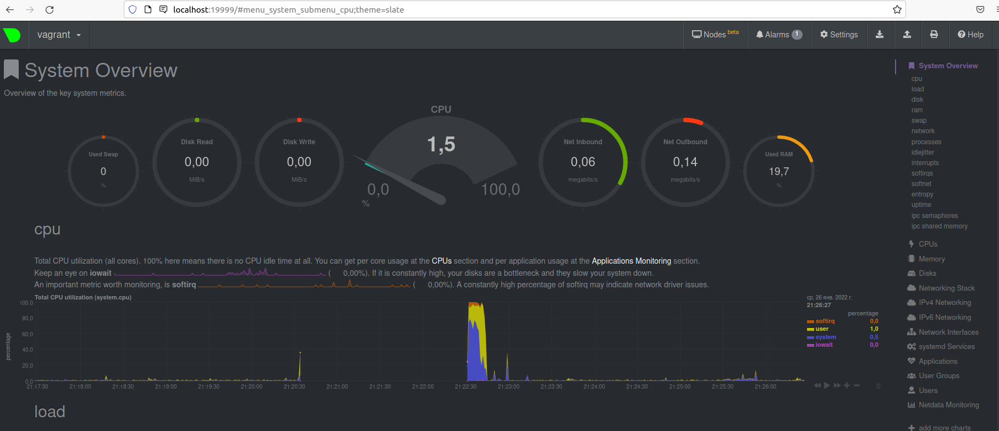

# devops-netology_3.4
1. 
- unit файл:  
[Unit]  
Description=Node Exporter Service  
After=network.target  

    [Service]  
EnvironmentFile=-/opt/node/node_exporter  
ExecStart=/usr/local/bin/node_exporter $OPTIONS  
ExecReload=/bin/kill -HUP $MAINPID  
Restart=on-failure  

    [Install]  
WantedBy=multi-user.target  

- добавление опций: ExecStart=usr/local/bin/node_exporter $OPTIONS через внешний файл: EnvironmentFile=--/opt/node/node_exporter  

- автозапуск: systemctl enable node_exporter  
- автоматический запуск после перезагрузки:  
node_exporter.service - Node Exporter Service  
     Loaded: loaded (/etc/systemd/system/node_exporter.service; enabled; vendor>  
     Active: active (running) since Tue 2022-01-25 22:40:58 +08; 33s ago  
   Main PID: 888 (node_exporter)  
- 

2. 
- CPU:  
node_cpu_seconds_total{cpu="0",mode="idle"} 58.39  
node_cpu_seconds_total{cpu="0",mode="iowait"} 1.01  
node_cpu_seconds_total{cpu="0",mode="nice"} 3.92  
node_cpu_seconds_total{cpu="0",mode="softirq"} 1.12  
node_cpu_seconds_total{cpu="0",mode="system"} 20.31  
node_cpu_seconds_total{cpu="0",mode="user"} 106.23  
node_cpu_seconds_total{cpu="1",mode="idle"} 56.3  
node_cpu_seconds_total{cpu="1",mode="iowait"} 1.73  
node_cpu_seconds_total{cpu="1",mode="nice"} 2.06  
node_cpu_seconds_total{cpu="1",mode="softirq"} 0.51  
node_cpu_seconds_total{cpu="1",mode="system"} 21.77  
node_cpu_seconds_total{cpu="1",mode="user"} 108.26  
- Memory  
node_memory_MemAvailable_bytes 4.952981504e+09  
node_memory_MemFree_bytes 2.767306752e+09  
node_memory_MemTotal_bytes 7.75215104e+09  

- Disk  
node_disk_read_bytes_total{device="sda"} 2.204672e+06  
node_disk_read_bytes_total{device="sdb"} 1.552221184e+09  
node_disk_read_time_seconds_total{device="sda"} 0.23600000000000002  
node_disk_read_time_seconds_total{device="sdb"} 14.093  
node_disk_write_time_seconds_total{device="sda"} 0  
node_disk_write_time_seconds_total{device="sdb"} 3.5740000000000003  

- Network  
node_network_receive_bytes_total{device="enp37s0"} 3.58224e+06  
node_network_receive_multicast_total{device="enp37s0"} 43  
node_network_receive_packets_total{device="enp37s0"} 4090  
node_network_speed_bytes{device="enp37s0"} 1.25e+08  
node_network_transmit_bytes_total{device="enp37s0"} 487430  

3. 
  
4. Да:  
- [    0.000000] DMI: innotek GmbH VirtualBox/VirtualBox, BIOS VirtualBox 12/01/2006  
- [    0.003357] CPU MTRRs all blank - virtualized system.  
5. cat /proc/sys/fs/nr_open  
Обозначает максимальное количество дескрипторов файлов, которые может выделить процесс. Значение по умолчанию: 1048576  
ulimit -n  
1024 (аксимальное количество открытых файловых дескрипторов)  
6. root@LSergeyO:~# unshare -f --pid --mount-proc sleep 1h  
root@LSergeyO:~# ps -e | grep sleep  
   3527 pts/0    00:00:00 sleep  
root@LSergeyO:~# nsenter --target 3527 --pid --mount --no-fork   
root@LSergeyO:/# ps aux  
USER         PID %CPU %MEM    VSZ   RSS TTY      STAT START   TIME COMMAND  
root           1  0.0  0.0  16716   588 pts/0    S+   23:01   0:00 sleep 1h  
root          11  0.0  0.0  20164  3488 pts/1    R+   23:02   0:00 ps aux  
7. 136.198953] cgroup: fork rejected by pid controller in /user.slice/user-1000.slice/session-3.scope  
Создаются дочернии процессы. Можно ограничить число процессов: ulimit -u 10  
 

